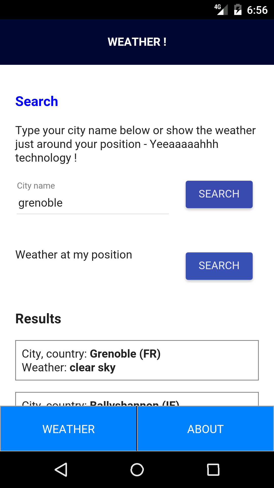

# Weather / Apache Cordova tutorial

Wonderful application that can tell you the weather around you. Developped to learn Apache Cordova. 
Note that is just one day of work, so app is very basic.

Tools:
* Angular JS, Angular materials
* JQuery
* Gulp / Sass
* Openweathermap API

Tested on Android 5.1.1 only.

Unsigned apk available at: https://github.com/remipassmoilesel/cordova-tutorial/raw/master/android-release-unsigned.apk

## Screenshot

